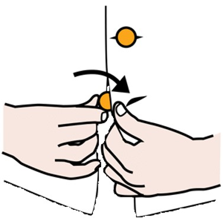

# Análisis del problema
# ¿Qué es la Lógica?

La lógica es una disciplina que se ocupa de los principios y criterios de la validez inferencial y la demostración. 
 


Es una herramienta esencial para el pensamiento crítico y el razonamiento. En el contexto de la programación, la lógica es fundamental para la construcción de algoritmos y la solución de problemas de manera estructurada y eficiente.

## Importancia de la Lógica en la Programación

La lógica en la programación se utiliza para:

1. **Resolver Problemas**: Permite descomponer problemas complejos en partes más manejables, identificar patrones y formular soluciones efectivas.
2. **Diseñar Algoritmos**: Los algoritmos son secuencias de pasos lógicos para resolver un problema o realizar una tarea. Un buen entendimiento de la lógica es crucial para diseñar algoritmos correctos y eficientes.
3. **Tomar Decisiones**: La programación a menudo implica tomar decisiones basadas en condiciones específicas. La lógica ayuda a formular estas condiciones de manera clara y precisa.
4. **Depuración y Pruebas**: La capacidad de razonar lógicamente sobre el comportamiento del código es esencial para identificar y corregir errores, así como para asegurar que el software funcione correctamente bajo diversas condiciones.

## Tipos de Lógica

En programación, se utilizan principalmente los siguientes tipos de lógica:

1. **Lógica Proposicional**: Trata con proposiciones que pueden ser verdaderas o falsas y se combinan utilizando operadores lógicos como AND, OR, y NOT.
2. **Lógica de Predicados**: Extiende la lógica proposicional al incluir variables y cuantificadores, lo que permite expresar propiedades y relaciones más complejas.
3. **Lógica Difusa**: Permite trabajar con valores de verdad que no son estrictamente verdaderos o falsos, sino que pueden ser cualquier valor en un rango continuo.

## Ejemplos de Uso de Lógica en Programación

### Lógica Proposicional

```python
a = True
b = False

# AND
print(a and b)  # False

# OR
print(a or b)  # True

# NOT
print(not a)  # False
